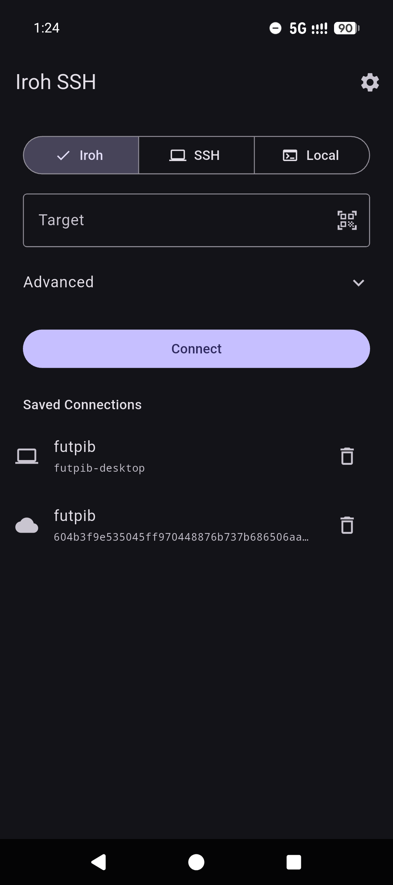
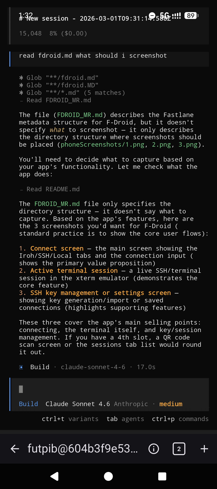
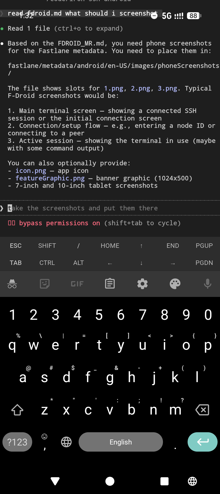

# Iroh SSH (Android)

An Android SSH client powered by [iroh](https://iroh.computer/) for peer-to-peer connections.

[](https://apps.obtainium.imranr.dev/redirect?r=obtainium://add/https://github.com/futpib/iroh-ssh-android)

## Screenshots

<table><tr>
<td></td>
<td></td>
<td></td>
</tr></table>

## Overview

iroh-ssh lets you open SSH sessions to remote hosts over the iroh peer-to-peer network.
Instead of requiring a routable IP address or VPN, it uses iroh's relay-assisted NAT traversal so you can reach machines behind firewalls or dynamic IPs — as long as both sides run an iroh-ssh endpoint.

The app is built with Flutter and bridges to a Rust core ([iroh-ssh](https://github.com/futpib/iroh-ssh)) via [flutter\_rust\_bridge](https://cjycode.com/flutter_rust_bridge/).

## Features

- **P2P SSH connections** — connect using `user@<endpoint-id>` without a public IP
- **Direct SSH connections** — connect via `user@host` or `user@host:port`, with persistent host-key trust and explicit confirmation for new or changed keys
- **Local shell** — open a local terminal session on the device
- **File manager** — browse SFTP or app-owned local files; downloads publish to Android Downloads. If publication is unavailable or fails, the copy remains under **Local → Files → downloads**, at the location shown in the notification.
- **Multiple sessions** — manage several concurrent sessions in tabs
- **Terminal emulator** — full xterm-compatible terminal with configurable font size and colour theme
- **SSH key management** — generate Ed25519 keys, import existing keys (PEM), copy/export public keys, and export private keys (protected by biometric authentication on Android)
- **QR code scanning** — on Android, scan a connection target from a QR code; import a private key from a QR code on all platforms
- **Saved connections** — quickly reconnect to previously used hosts
- **Background sessions** — on Android, sessions run in a foreground service so they survive app backgrounding
- **Configurable relay servers** — use iroh's default relays, add custom relay URLs, or disable relays entirely
- **Cross-platform** — primarily Android; also runs on Linux and macOS (no foreground service)

## APK downloads

The **Build APK** workflow publishes a universal APK and smaller, standalone
APKs for each supported architecture. Install one APK that matches your device;
these do not require a split-APK installer.

| Architecture | ML Kit scanner | F-Droid scanner |
|---|---|---|
| Universal | `app-release.apk` | `app-release-fdroid.apk` |
| ARM64 (`arm64-v8a`) | `app-arm64-v8a-release.apk` | `app-arm64-v8a-release-fdroid.apk` |
| ARMv7 (`armeabi-v7a`) | `app-armeabi-v7a-release.apk` | `app-armeabi-v7a-release-fdroid.apk` |
| x86_64 | `app-x86_64-release.apk` | `app-x86_64-release-fdroid.apk` |

Use ARM64 for most current phones, or the universal APK if unsure. When updating,
keep the same APK architecture: Flutter gives per-ABI APKs different version-code
offsets, so switching back to a universal APK can be treated as a downgrade.
All APKs in a release use the same version name and signing configuration.

## In-app updates

On Android, **Settings → Updates** has an automatic-check toggle and **Check now**.
Automatic checks contact GitHub's latest stable release API once at app startup;
a newer version shows a non-blocking notice. **Update** opens the in-app updater.
Checks never download or install anything automatically.

**Download update** downloads the APK into private app storage with progress,
cancellation and retry. The updater preserves the installed scanner variant and
universal/per-ABI packaging using metadata embedded in the signed APK. It requires
GitHub's SHA-256 digest and checks the APK's size, package name, version, signing
certificate and native architectures before offering **Install**. Installation
revalidates the file and rejects older or same-version-code APKs.

**Install** warns that updating disconnects active terminals. Android performs
the installation after user confirmation. On Android 8+, first allow installation
from Iroh SSH in the system screen, return to the app and tap **Install** again.
Cancelling installation keeps the verified download available for retry. The
installed version is checked when the app next opens; an installer launch alone
is never reported as a successful update. Saved connections and settings remain.
A complete verified download survives app restarts while its cache file exists;
interrupted downloads can be retried from the beginning. Downloads are not a
separate background service, so Android may stop them if it kills the app.

The default is **off** when Android reports Obtainium (`dev.imranr.obtainium` or
`dev.imranr.obtainium.fdroid`) as the installer, and **on** otherwise, including
when the installer is unknown. Merely tracking an app in Obtainium, or using an
external installer through Obtainium, may not identify it as an Obtainium install.
An explicit toggle choice overrides installer detection. The effective setting
is saved before a self-update, since installing from Iroh SSH can change Android's
installer record. Manual checks work even when automatic checks are off.

The Build APK workflow records the scanner with
`--dart-define=UPDATE_SCANNER=fdroid` or `mlkit`; packaging is recorded from
Flutter's `--split-per-abi` flag. Local builds default to `fdroid`. If manually
substituting the ML Kit scanner source, pass `--dart-define=UPDATE_SCANNER=mlkit`.
Only APKs with matching metadata and signing certificates can be installed by
this updater; it does not switch signing keys or release variants.

## Usage

### iroh P2P connection

1. On the server side, expose an SSH server through [iroh-ssh](https://github.com/futpib/iroh-ssh) and note the endpoint ID it prints.
2. Open the app, select the **Iroh** tab, and type or paste the connection target in the form `user@<endpoint-id>` (or scan it on Android).
3. Tap **Connect**.

The app will establish a peer-to-peer tunnel and open an interactive terminal session.

### Direct SSH connection

1. Select the **SSH** tab and type or paste a target in the form `user@host`, `user@host:port`, or `user@[IPv6]:port`.
2. Tap **Connect**.

Open **Settings → Keys** to generate or import an identity.
Stored keys are offered when the server accepts key authentication; the app
still shows password or other prompts selected during SSH authentication.

### Local shell

Select the **Local** tab and tap **Open Shell** to start a local terminal session on the device.

## Selecting terminal text

Long press or double tap a word, then drag the selection handles to adjust it.
The floating menu offers **Copy**, **Paste**, and **Select All** (including
scrollback). Drag a handle near the top or bottom edge to extend the selection
through scrollback. Selecting text pauses touch scrolling and cursor-following;
selection gestures do not send wheel input to tmux or vim. Tap elsewhere to
clear the selection and resume ordinary scrolling.

In tmux, enter copy mode to bring older output onto the screen before selecting
it. With tmux mouse mode enabled, touch scrolling enters copy mode. **Select All**
copies the terminal buffer currently exposed by tmux, not its hidden history.

## Building

Prerequisites:
- [Flutter](https://docs.flutter.dev/get-started/install) (see `.fvmrc` for the Flutter channel tracked via [fvm](https://fvm.app/))
- [Rust](https://rustup.rs/) with the Android NDK targets (for Android builds)
- [flutter\_rust\_bridge\_codegen](https://cjycode.com/flutter_rust_bridge/integrate/setup_toolchain) for regenerating the FFI bindings

```bash
# Install Flutter dependencies
flutter pub get

# Build and run (Android)
flutter run
```

## Project Structure

| Path | Description |
|------|-------------|
| `lib/` | Flutter/Dart application code |
| `lib/models/` | Data models (session info, connection types) |
| `lib/screens/` | UI screens (connect, sessions, settings, QR scanner) |
| `lib/services/` | Storage, SSH session management, foreground service IPC |
| `lib/widgets/` | Reusable UI widgets |
| `rust/` | Rust crate — thin FFI bridge to `iroh-ssh` |
| `rust_builder/` | Flutter plugin that compiles the Rust crate |
| `android/` | Android-specific configuration |
